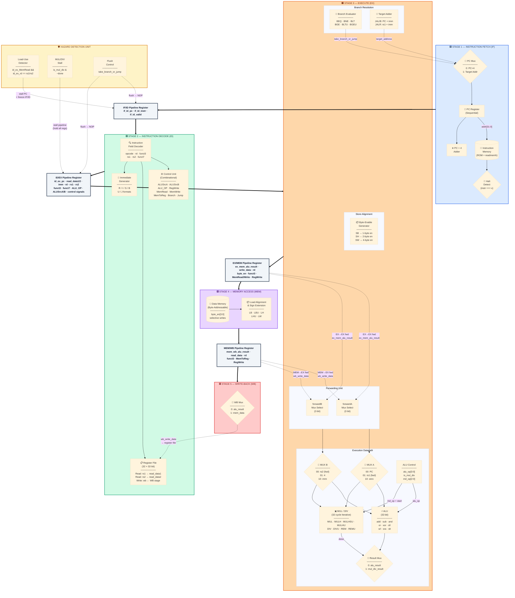

# RISC-V RV32IM 5-Stage Pipelined Processor

A highly optimized, fully synthesizable **5-stage pipelined RISC-V RV32IM processor** implemented in synthesizable Verilog. It features a spatial 5-stage pipeline, a combinational control unit, a dynamic hazard detection and forwarding unit to resolve data hazards, a hardware-realistic iterative M-extension (multiplication and division) with pipeline stall support, a cycle-accurate Python golden model for co-simulation, a dynamic verification harness, and a robust CI regression test pipeline.

The hallmark of this repository is the complete hardware-realistic integration of the **RISC-V M-Extension** (Multiplication and Division) featuring 32-cycle iterative execution and dynamic pipeline stalling within a classic pipelined datapath.

---

## Key Features

1. **5-Stage Spatial Pipeline**: Overlaps instruction execution across five distinct stages: Fetch (IF), Decode (ID), Execute (EX), Memory (MEM), and Write-Back (WB) for maximum throughput.
2. **Hazard Detection & Forwarding Unit**:
   - **Data Forwarding**: Resolves EX-to-EX and MEM-to-EX data hazards without stalling, routing intermediate results directly to the ALU inputs.
   - **Load-Use Stall**: Detects load-use hazards (for all base and sub-word loads) and automatically inserts a 1-cycle pipeline bubble (stall).
   - **Control Hazard Flush**: Flushes instructions in the IF and ID stages upon resolving taken branches or jumps in the EX stage, minimizing branch penalty.
3. **Combinational Control Unit (`control_unit.v`)**: Generates all instruction control signals combinationaly during the Decode (ID) stage, which propagate downstream through sequential pipeline registers.
4. **Iterative M-Extension (`mul_div.v`)**:
   - **Multiplication**: A hardware-realistic 32-cycle shift-and-add multiplier supporting `MUL`, `MULH`, `MULHSU`, and `MULHU`.
   - **Division / Remainder**: A hardware-realistic 32-cycle restoring divider supporting `DIV`, `DIVU`, `REM`, and `REMU`.
   - **Pipeline Stall**: Stalls the pipeline in the EX stage while the iterative multiplier/divider is active, resuming execution smoothly upon completion.
5. **Full Sub-word Load/Store Support**: Integrates selective write byte-enables (`byte_en[3:0]`) for byte and halfword writes in `data_mem.v`, paired with dynamic processor-side alignment and sign/zero-extensions for sub-word reads (`LB`, `LBU`, `LH`, `LHU`, `SB`, `SH`).
6. **Co-Simulation SVT Framework**: Dynamic register and memory validation comparing the physical RTL simulation directly against an automated Python Instruction Set Simulator (ISS) golden model.
7. **CI Regression Tests**: 7 different operation-specific categories running parallel test injections using runtime `$readmemh` parameter mapping (`+TEST_DIR`).
8. **Continuous Integration**: GitHub Actions workflow (.github/workflows/makefile.yml) automatically compiles, verifies SVT, and runs regressions on all push and pull requests.

---

## Architectural Details

### 5-Stage Pipeline Overview



> **Pipeline Register Key** — `IF/ID`, `ID/EX`, `EX/MEM`, `MEM/WB` are sequential edge-triggered registers that boundary-separate each stage and carry both datapath values and control signals downstream.

### Hazard Summary

| Hazard Type | Detection | Resolution | Penalty |
|---|---|---|---|
| **EX-to-EX Data** | `ex_mem_rd == id_ex_rs{1,2}` | MUX A/B forward `ex_mem_alu_result` | **0 cycles** |
| **MEM-to-EX Data** | `mem_wb_rd == id_ex_rs{1,2}` | MUX A/B forward `wb_write_data` | **0 cycles** |
| **Load-Use** | `id_ex_MemRead && rd matches rs` | Stall PC + IF/ID, inject bubble into ID/EX | **1 cycle** |
| **Control (Taken Branch/Jump)** | `take_branch_or_jump` in EX | Flush IF/ID and ID/EX (NOP injection) | **2 cycles** |
| **M-Extension (MUL/DIV)** | `is_mul_div && ~done` | Hold all pipeline registers; inject EX/MEM bubble | **32 cycles** |

### Instruction Performance Characterization

| Condition / Instruction Type | Wasted Cycles | Effective CPI | Pipeline Behavior |
|---|---|---|---|
| **Ideal Arithmetic / Logic** | 0 | **1** | Fully overlapped; forwarding covers all data hazards. |
| **Data Hazard (ALU-to-ALU)** | 0 | **1** | EX/MEM or MEM/WB result forwarded directly to ALU inputs. |
| **Load-Use Hazard** | 1 | **2** | 1-cycle bubble inserted so memory read reaches EX via forwarding. |
| **Taken Branch / Jump** | 2 | **3** | 2 wrongly-fetched instructions flushed with NOP bubbles. |
| **M-Extension MUL/DIV** | 32 | **33** | Pipeline stalled for 32 iterations; resumes after `done` pulses. |

---

## Supported Instruction Set

### RV32I Base Integer Instructions
- **R-Type**: `ADD`, `SUB`, `AND`, `OR`, `XOR`, `SLL`, `SRL`, `SRA`, `SLT`, `SLTU`
- **I-Type**: `ADDI`, `ANDI`, `ORI`, `XORI`, `SLLI`, `SRLI`, `SRAI`, `SLTI`, `SLTIU`
- **Load/Store**: `LW`, `LH`, `LHU`, `LB`, `LBU`, `SW`, `SH`, `SB` (fully supporting byte-enable selective writes and dynamic sign/zero-extended sub-word loads)
- **Branch**: `BEQ`, `BNE`, `BLT`, `BGE`, `BLTU`, `BGEU`
- **Jumps**: `JAL`, `JALR` (clears the LSB of the target address to 0 to ensure strict 32-bit instruction alignment)
- **Upper Immediate**: `LUI`, `AUIPC`

### RV32M Extension Instructions
- **Multiplication**: `MUL` (low 32-bits), `MULH` (signed x signed high), `MULHU` (unsigned x unsigned high), `MULHSU` (signed x unsigned high)
- **Division / Remainder**: `DIV` (signed division), `DIVU` (unsigned division), `REM` (signed remainder), `REMU` (unsigned remainder)

---

## Directory Structure

```
RISCV_RV32IM_Pipelined/
├── src/
│   ├── core/
│   │   ├── rv32im_pipelined.v    # Top-level datapath, hazard unit & pipeline registers
│   │   ├── control_unit.v        # Combinational control unit
│   │   ├── alu_control.v         # Decodes ALU operation (standard and M-type)
│   │   ├── imm_gen.v             # Immediate generator (R/I/S/B/U/J formats)
│   │   └── register.v            # 32x32 register file with internal forwarding
│   ├── alu/
│   │   ├── ALU_n_bit.v           # Base N-bit parameterized ALU
│   │   ├── full_adder_n_bit.v    # Ripple-carry adder
│   │   └── mul_div.v             # 32-cycle iterative multiplication and division module
│   └── memory/
│       ├── instruction_mem.v     # Dynamic runtime memory injection (readmemh)
│       └── data_mem.v            # Data memory
├── tb/
│   ├── rv32im_tb.v               # Main testbench (module: rv32im_tb)
│   ├── svt_tb.v                  # Co-simulation verification testbench
│   └── test_lw_sw.v              # Simple memory access sanity testbench
├── scripts/
│   └── golden_model.py           # Cycle-accurate python instruction set simulator (ISS)
├── tests/
│   ├── I-Type/                   # Hex tests for immediate arithmetic
│   ├── R-Type/                   # Hex tests for register arithmetic
│   ├── U-Type/                   # Hex tests for LUI and AUIPC
│   ├── J-Type/                   # Hex tests for unconditional jumps
│   ├── Mul/                      # Hex tests for MUL, MULH, MULHU, MULHSU
│   ├── Div/                      # Hex tests for DIV, DIVU, REM, REMU
│   └── Edge_Cases/               # Hex tests for Divide by Zero, Overflow, etc.
├── .github/
│   └── workflows/
│       └── makefile.yml          # GitHub Actions CI Workflow config
├── Makefile                      # Build automation script
└── README.md
```

---

## Verification & Testing

### 1. Verification Framework (SVT)
The **Software Verification Testbench (SVT)** uses a co-simulation approach where the cycle-accurate Python ISS compiles the target program and extracts a cycle-by-cycle golden reference state of all Registers, PC, and Memory. 

The Verilog RTL simulates the program, and at the end of execution, `svt_tb.v` automatically runs absolute asserts to compare the hardware registers/memory against the golden `.hex` results.

### 2. Regression Testing (`make regression`)
To run the automated, categorized regression suite across all 7 test categories:
```bash
make regression
```

This target runs a shell loop over the `tests/` directory, invoking the golden model for each test to generate directory-specific outputs, runs the RTL simulation passing `+TEST_DIR=<test>`, and logs the overall status:

```text
=======================================================
              RUNNING REGRESSION SUITE                 
=======================================================
Running tests/Div...
[PASS] Div
Running tests/Edge_Cases...
[PASS] Edge_Cases
Running tests/I-Type...
[PASS] I-Type
Running tests/J-Type...
[PASS] J-Type
Running tests/Mul...
[PASS] Mul
Running tests/R-Type...
[PASS] R-Type
Running tests/U-Type...
[PASS] U-Type
=======================================================
```

If even one test category reports a mismatch, `make regression` exits with a non-zero code (`exit 1`) to fail the continuous integration pipeline.

### 3. Continuous Integration (CI)
GitHub Actions are fully integrated via `.github/workflows/makefile.yml`. Every single commit and pull request triggers a runner that:
1. Spins up an Ubuntu container.
2. Installs `iverilog` and `python3` dependencies.
3. Runs `make svt` to verify the baseline CPU integrity.
4. Runs `make regression` to verify all 7 isolated hardware operations.

---

## Quick Start (Usage Guide)

### Install Prerequisites (Ubuntu/Linux)
```bash
sudo apt-get update
sudo apt-get install -y iverilog python3
```

### Run Sanity Check Program
```bash
make svt
```

### Run Full Regression Suite
```bash
make regression
```

### Clean Simulation Binaries
```bash
make clean
```